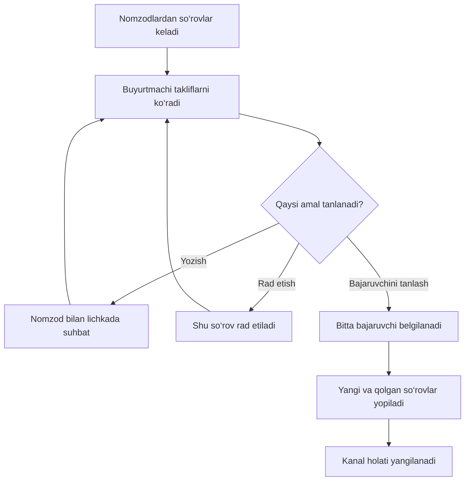

# Qulay Savdo Bot — bot haqida to‘liq qo‘llanma

> Botning vazifalari, bo‘limlari, tugmalari va ishlash tartibi. 2026-09-26 · v4: qoralamalar, oldindan ko‘rish, ochiq zakazlar, profillar, yordam va sozlanadigan tekshirish muddati.

## 1. Bot nima uchun kerak?

**Qulay Savdo Bot** — tayyor raqamli mahsulotlarni e’lon qilish va yangi dasturiy ishlar uchun bajaruvchi topishga yordam beradigan Telegram bot.

Botda ikkita asosiy yo‘nalish mavjud:

| Yo‘nalish | Maqsadi | Oddiy misol |
| --- | --- | --- |
| **E’lon berish** | Tayyor mahsulotni sotuvga chiqarish | Tayyor bot, sayt yoki ilovani sotish |
| **Zakaz berish** | Kerakli mahsulotni tayyorlab beradigan odam topish | Internet-do‘kon, Telegram bot yoki mobil ilova buyurtma qilish |

**Asosiy qoida:** pullik rejimda joylashtirish uchun haq olinadi. Admin pullik rejimni o‘chirsa e’lon va zakaz bepul, lekin admin tekshiruvi saqlanadi. Bajaruvchining taklifi har doim bepul.

## 2. Botdan kimlar foydalanadi?

| Ishtirokchi | Kim? | Nima qiladi? |
| --- | --- | --- |
| **E’lon egasi** | Tayyor mahsulot sotuvchisi | Mahsulotini e’lon qiladi va e’lonini boshqaradi |
| **Zakaz egasi — buyurtmachi** | Biror ishni qildirmoqchi bo‘lgan odam | Topshiriq joylashtiradi, takliflarni ko‘radi va bajaruvchini tanlaydi |
| **Nomzod — bajaruvchi** | Zakazni bajarishga qiziqqan odam | Narx, muddat va izoh bilan bepul so‘rov yuboradi |
| **Admin** | Botni boshqaruvchi | Cheklarni tekshiradi, e’lonlarni nazorat qiladi va shikoyatlarni ko‘rib chiqadi |

Bir odam turli vaqtda ham buyurtmachi, ham bajaruvchi, ham sotuvchi bo‘lishi mumkin. Buning uchun alohida hisob ochish shart emas.

## 3. Asosiy menyu

| Bo‘lim nomi | Vazifasi |
| --- | --- |
| **📢 Tayyor dasturimni sotaman** | Tayyor mahsulotni kanalga joylashtirish jarayonini boshlaydi |
| **🛠 Dasturchi topaman** | Yangi topshiriq yaratish jarayonini boshlaydi |
| **📋 Mening e’lonlarim** | O‘z e’lonlarini va ularning holatini ko‘rsatadi |
| **📋 Mening zakazlarim** | O‘z zakazlarini, kelgan so‘rovlarni va yakunlash imkonini ko‘rsatadi |
| **🔎 Kod orqali topish** | Kanaldagi zakaz raqami orqali kerakli topshiriqni topadi |
| **📨 Yuborgan takliflarim** | Bajaruvchi yuborgan takliflar va ularning natijalarini ko‘rsatadi |
| **🎁 E’lon uchun bonus olish** | Kanalga shaxsiy taklif havolasi, bonus va balansni ko‘rsatadi |
| **ℹ️ Qoidalar** | Platformadan foydalanish qoidalarini ko‘rsatadi |
| **🔎 Ochiq zakazlar** | Bot, sayt, mobil ilova va boshqa yo‘nalishlardagi ochiq topshiriqlar |
| **📝 Qoralamalar** | Saqlangan matnlar va hali yakunlanmagan to‘lov jarayonlari |
| **👤 Profilim** | Mutaxassislik, o‘zingiz haqingizda ma’lumot va portfolio |
| **🔔 Mos zakazlar** | Yo‘nalish bo‘yicha ixtiyoriy bildirishnomalarni boshqarish |
| **🏆 Bajarilgan ishlar** | Ikki tomon ko‘rsatishga rozilik bergan yakunlangan topshiriqlar |
| **🆘 Yordam olish** | Adminga muammo yozish va botda javob olish |
| **🛠 Admin panel** | Faqat adminlarga ko‘rinadigan boshqaruv bo‘limi |

Jarayondan chiqish post matnini o‘chirmaydi. Yuborilgan e’lon/zakaz matni **Qoralamalar**da saqlanadi. **Qoralamani o‘chirish** alohida tasdiq bilan ishlaydi. Taklif va profilning hali yuborilmagan matni alohida qoralama sifatida saqlanmaydi. Jarayondan chiqish bank orqali amalga oshirilgan to‘lovni qaytarmaydi.

## 4. Zakaz berish — buyurtmachi uchun

1. **Dasturchi topaman**ni tanlang. Narx, nima uchun to‘lanishi va admin tekshirish muddati topshiriq yozishdan oldin ko‘rsatiladi. Bepul rejim yoqilgan bo‘lsa bu ham aniq yoziladi.
2. Yo‘nalishni tanlang: Telegram bot, sayt, mobil ilova yoki boshqa dastur. Tanlanmasa “Boshqa dastur” saqlanadi.
3. Kerakli funksiyalar, taxminiy budjet va muddatni matnda yoki bitta rasm izohida yuboring. Bot kod yaratib, matnni qoralamaga saqlaydi.
4. **Postingizni tekshiring** oynasida matnni ko‘ring: **Davom etish**, **Tahrirlash**, **Saqlab chiqish** yoki **Qoralamani o‘chirish**ni tanlang.
5. Davom etishda bot haqiqiy Telegram profilingizdagi username’ni tekshiradi. Username yo‘q bo‘lsa Telegram sozlamalarida o‘rnating, **Username’ni tekshirish**ni, keyin **Davom etish**ni bosing. Qoralama saqlanadi.
6. Pullik rejimda karta orqali to‘lab, bitta chek rasmini yuboring. Bepul rejimda karta va chek so‘ralmaydi. Zakaz uchun bonus balansidan to‘lash yo‘q.
7. Qabul xabarida **admin tekshiruvida**, tekshirish muddati va Toshkent vaqtidagi aniq chegara ko‘rsatiladi. **Holatni ko‘rish** va **Yordam olish** tugmalari bor.
8. Admin tasdiqlagach zakaz kanalga chiqadi. Keyin bepul takliflar keladi.

Bosqichlar: **1/3 — matn → 2/3 — tekshirish → 3/3 — to‘lov/yuborish**.

Bosh menyuga o‘tish, boshqa bo‘limni ochish yoki botni qayta boshlash post matnini o‘chirmaydi. **Qoralamalar → Zakazlar → kod** orqali davom eting. Avval ko‘rsatilgan to‘lov summasi davom ettirilganda saqlanadi. Username qo‘lda taxminan qidirilmaydi; bot Telegram yuborgan profil ma’lumotidan foydalanadi.

## 5. Kanalda zakaz qanday ko‘rinadi?

| Qism | Natija |
| --- | --- |
| Holat | Ochiq, bajaruvchi tanlangan, yakunlash tekshiruvda yoki to‘liq tugatilgan |
| Zakaz kodi | Bot avtomatik yaratadi, masalan `ZK-10000`; alohida monospace yozuvda turadi |
| **📋 ZK-10000 — nusxalash** | Bir bosishda aynan kodni nusxalaydi |
| Topshiriq va kanal imzosi | Ish mazmuni va admin belgilagan imzo |
| **Bepul so‘rov yuborish** | Ochiq zakazga taklif tayyorlash |
| **Shikoyat qilish** | Ochiq post haqida adminga murojaat |

Kod tasodifiy to‘rt xonali raqamlar bilan cheklanmaydi: ketma-ket o‘sadi va kerak bo‘lsa xonalar soni ko‘payadi. Eski kodlar saqlanadi, qayta ishlatilmaydi. Bu amaliy jihatdan juda katta miqdordagi zakazlarni qo‘llaydi; ma’lumotlar bazasi va disk hajmi baribir cheklangan resurslardir.

Kod botning asosiy menyusiga yuboriladi yoki **Zakazni topish** orqali qidiriladi. Uzun topshiriqning to‘liq matni botda ko‘rinadi. Kodning o‘zini bosish xatti-harakati Telegram ilovasiga bog‘liq; alohida nusxalash tugmasi shu amal uchun mo‘ljallangan.

## 6. Bepul so‘rov yuborish — bajaruvchi uchun

Bajaruvchi zakazni ochib, **Bepul so‘rov yuborish** tugmasini bosadi.

Bot uchta ma’lumot so‘raydi:

| Bosqich | Savol | Nima yoziladi? |
| --- | --- | --- |
| **1. Narx** | Ishni qancha pulga bajarasiz? | So‘mda taklif narxi yoki **Kelishiladi** |
| **2. Muddat** | Ishni qachongacha tugatasiz? | Masalan, besh kun yoki ikki hafta |
| **3. Izoh** | Nima taklif qilasiz? | Tajriba, ishga yondashuv yoki portfolio havolasi |

Izoh 800 belgigacha bo‘lishi mumkin. Keyin **Taklifni tekshiring** oynasi chiqadi.

Bu oynada uchta imkoniyat bor:

| Tugma | Natija |
| --- | --- |
| **📩 Bepul yuborish** | Taklif zakaz egasiga yuboriladi |
| **✏️ Qayta yozish** | Yuborishdan oldin taklif qaytadan tayyorlanadi |
| **Bekor qilish** | Taklif yuborilmasdan jarayondan chiqiladi |

**So‘rov yuborish uchun pul yechilmaydi, karta yoki chek so‘ralmaydi.**

Bitta odam bitta zakazga faqat bitta so‘rov yuboradi. So‘rovi rad etilgan bo‘lsa ham o‘sha zakazga qayta yubora olmaydi. Boshqa ochiq zakazlarga taklif berishi mumkin.

## 7. Zakaz egasiga keladigan so‘rov

Har bir nomzodning so‘rovi alohida xabar sifatida keladi.

### So‘rov kartasining tarkibi

| Ko‘rinadigan ma’lumot | Mazmuni |
| --- | --- |
| **Nomzodning username’i** | Kim taklif yuborganini ko‘rsatadi |
| **Zakaz raqami** | Taklif qaysi topshiriqqa tegishli ekanini bildiradi |
| **So‘rov holati** | Javob kutilayotgani yoki qaror qabul qilinganini ko‘rsatadi |
| **Taklif narxi** | Nomzod so‘ragan haq |
| **Bajarish muddati** | Nomzod taklif qilgan muddat |
| **Izoh** | Nomzodning tushuntirishi va portfolio ma’lumoti |

### So‘rov kartasidagi tugmalar

| Tugma | Nima qiladi? |
| --- | --- |
| **💬 Yozish** | Nomzodning Telegramdagi shaxsiy chatini ochadi |
| **✅ Shu bajaruvchini tanlash** | Zakazni shu nomzodga biriktiradi va tanlovni yopadi |
| **❌ Rad etish** | Faqat shu nomzodning so‘rovini rad etadi |
| **📨 Barcha so‘rovlar** | Shu zakazga kelgan takliflar ro‘yxatini ochadi |

**Yozish tugmasini bosish nomzodni tanlash hisoblanmaydi.**

Rad etilgan taklifning xabari o‘chirilmaydi. Username, Telegram ID, narx, muddat va izoh saqlanadi. **Barcha so‘rovlar** orqali keyin ham taklifni ochish va yozish mumkin. Profil username’i o‘zgarsa ham taklif yuborilgan paytdagi username ko‘rsatiladi; eski username havolasi ishlashiga kafolat yo‘q.

## 8. Suhbat qayerda bo‘ladi?

Suhbat ikki odamning **Telegramdagi shaxsiy chatida — lichkada** bo‘ladi.

- Buyurtmachi nomzod kartasidagi **Yozish** tugmasini bosadi.
- Nomzod so‘rov yuborgach, o‘z so‘rovi tafsilotidan buyurtmachiga yozishi mumkin.
- Narx, muddat va boshqa shartlar shaxsiy chatda kelishiladi.
- Bot shaxsiy yozishmalarni o‘qimaydi yoki o‘zidan o‘tkazib bermaydi.

Buyurtmachi bir vaqtning o‘zida bir nechta nomzod bilan gaplashishi mumkin. Yangi takliflar **bajaruvchi tanlanguncha** kelishda davom etadi.

### Nega username kerak?

Username shaxsiy chatga olib boradigan havola uchun kerak. Zakaz beruvchi va nomzodda username bo‘lishi talab qilinadi. Username o‘zgarsa, bot bilan keyingi muloqotda profil yangilanadi. Username yo‘qligida tekshirish tugmasi yordam beradi.

## 9. Bajaruvchini tanlash va rad etish

### Tanlash qanday ishlaydi?

Buyurtmachi **Shu bajaruvchini tanlash** tugmasini bosganda:

1. Bitta nomzod bajaruvchi sifatida belgilanadi.
2. Zakaz uchun yangi so‘rovlar yopiladi.
3. Boshqa kutilayotgan so‘rovlar yopiladi.
4. Tanlangan bajaruvchiga xabar yuboriladi.
5. Qolgan nomzodlarga boshqa bajaruvchi tanlangani bildiriladi.
6. Kanal postining holati yangilanadi.

Eski so‘rov xabarlaridagi tugmalar orqali ikkinchi bajaruvchini tanlab bo‘lmaydi. Hatto tugmalar bir vaqtda bosilsa ham bitta nomzod tanlanadi.

### Rad etish qanday ishlaydi?

**Rad etish** faqat tanlangan so‘rovga ta’sir qiladi. Nomzodga natija yuboriladi. Zakaz ochiq qoladi, boshqa nomzodlar bilan suhbat va tanlov davom etadi.

### Tanlov sxemasi

Tanlash qarorini faqat zakaz egasi qabul qiladi. Boshqa foydalanuvchilar uning o‘rniga nomzodni tasdiqlay olmaydi.

**“Tasdiqlash”ning farqi:** admin yangi zakazni tasdiqlasa, u ochiq holda kanalga chiqadi. Buyurtmachi bajaruvchini tanlasa, yangi takliflar yopiladi va ikki tomon shaxsiy chatda ishlashni boshlaydi. Ish tugaganini tasdiqlash esa alohida jarayon bo‘lib, 11-bo‘limda tushuntirilgan.

## 10. Tanlovdan keyin kanal va botda nima ko‘rinadi?

| Holat | Kanalda | Botda |
| --- | --- | --- |
| **Zakaz ochiq** | Ochiq holat va bepul so‘rov tugmasi | Yangi taklif yuborish mumkin |
| **Bajaruvchi tanlangan** | Zakaz raqami ustida **ZAKAZ QABUL QILINGAN — bajaruvchi tanlandi** | Yangi so‘rov qabul qilinmaydi |
| **Ikki tomon yakunlashni tasdiqlagan** | **ISH YAKUNI — admin tasdig‘i kutilmoqda** | Admin tekshiradi; yangi takliflar yopiq |
| **Ish bajarilgan** | **ISH BAJARILDI — zakaz yakunlangan**, **Zakaz to‘liq tugatildi** tugmasi | Admin yakunlashni tasdiqlagan |
| **Zakaz yopilgan** | **ZAKAZ YOPILGAN** | Yangi so‘rov qabul qilinmaydi |

Bajaruvchi tanlanganda post kanaldan o‘chirilmaydi. So‘rov yuborish tugmasi o‘rniga zakaz holatini ko‘rish tugmasi chiqadi.

Kimdir zakaz raqamini keyinroq botga yuborsa, uning yopilgan yoki bajaruvchi tanlangan holatini ko‘radi.

Kanal postini yangilash vaqtincha ishlamasa ham, bot yangi so‘rovlarni qabul qilmaydi. Kanal yozuvini yangilashga keyinroq qayta uriniladi.

## 11. Kelishuv buzilsa yoki ish tugasa

### Kelishuv buzilsa — qayta ochish

Zakaz egasi **Mening zakazlarim → zakaz → Zakazni qayta ochish**ni bosib, qarorini tasdiqlaydi.

- Oldingi zakaz kodi va kanaldagi aynan o‘sha post saqlanadi. Yangi post yuborilmaydi va yangi to‘lov olinmaydi.
- Bajaruvchi tanlovi bekor qilinadi. Holat yana **OCHIQ — takliflar qabul qilinmoqda** bo‘ladi.
- Oldingi username va takliflar o‘chmaydi. Rad etilgan va yopilgan takliflar avtomatik faollashmaydi. Egasi kerakli taklifni ochib **Qayta ko‘rib chiqish**ni bosadi. Nomzodga xabar boradi; taklif yana tanlovda bo‘ladi.
- Oldingi yakunlash tasdiqlari bekor qilinadi. Eski kelishuvning tasdiqlash tugmalari yangi kelishuvni yakunlay olmaydi.
- Bir zakaz **jami ko‘pi bilan ikki marta** qayta ochiladi. Uchinchi urinish rad etiladi.
- Qayta ochish bajaruvchi tanlangan yoki yakunlash admin tekshiruvida bo‘lgan zakazga tegishli. To‘liq yakunlangan zakaz qayta ochilmaydi.

### Ish tugasa — ikki tomon va admin

1. Buyurtmachi **Mening zakazlarim** ichida **Ish tugaganini tasdiqlash**ni bosadi.
2. Tanlangan bajaruvchi **Mening so‘rovlarim → so‘rov tafsilotlari** ichida shu tugmani bosadi. Qaysi tomon birinchi bosishi ahamiyatsiz.
3. Har ikkisi “Ha, ish tugadi”ni tasdiqlagach, adminga bildirishnoma keladi.
4. Admin **Barcha kutilayotganlar** ichida yakunlashni tasdiqlaydi yoki rad etadi.
5. Admin tasdiqlasa, kanalda **ISH BAJARILDI — zakaz yakunlangan** va **🏁 Zakaz to‘liq tugatildi** tugmasi chiqadi. Post va kod saqlanadi.
6. Admin rad etsa, zakaz bajaruvchi tanlangan holatga qaytadi. Ikki tomon ish tugagach qaytadan tasdiqlaydi.

Faqat bir tomonning bosishi ishni yakunlamaydi. Buyurtmachi boshqa bajaruvchi nomidan yoki bajaruvchi buyurtmachi nomidan tasdiqlay olmaydi.

## 12. Mening zakazlarim va Mening so‘rovlarim

| Bo‘lim | Kim uchun? | Nimalar ko‘rinadi? |
| --- | --- | --- |
| **Mening zakazlarim** | Buyurtmachi | O‘z zakazlari, holatlari va kelgan so‘rovlar |
| **Kelgan so‘rovlar** | Buyurtmachi | Shu zakazga murojaat qilgan nomzodlar |
| **Mening so‘rovlarim** | Bajaruvchi | O‘zi yuborgan takliflar va ularning natijalari |

Ro‘yxat uzun bo‘lsa, **Oldingi** va **Keyingi** tugmalari bilan sahifalar almashtiriladi. Mening e’lonlarim va zakazlarimda **Barchasi**, **Qoralamalar**, **Faol**, **Tekshiruvda**, **Yakunlangan** filtrlari bor. Takliflarni **Takliflarni solishtirish** orqali narx, muddat, holat va portfolio bilan yonma-yon mazmunda ko‘rish mumkin; Telegramda ular ketma-ket kartalar shaklida chiqadi.

So‘rovning asosiy holatlari:

| Holat | Tushuntirish |
| --- | --- |
| **Javob kutilmoqda** | Buyurtmachi hali qaror qilmagan |
| **Bajaruvchi tanlangan** | Ushbu nomzod tanlangan |
| **Taklif rad etildi** | Buyurtmachi shu taklifni rad etgan |
| **Tanlov yakunlandi** | Boshqa nomzod tanlangan yoki zakaz yopilgan |

Begona foydalanuvchi boshqa odamlarning so‘rovlarini ko‘ra olmaydi. So‘rov tafsilotlari zakaz egasi va uni yuborgan nomzodga ochiq.

## 13. Tayyor mahsulot uchun e’lon berish

**Tayyor dasturimni sotaman** → narx va muddatni ko‘rish → matn/rasm yuborish → oldindan ko‘rish va tahrirlash → to‘lov yoki bepul yuborish → admin tekshiruvi → kanal.

E’londa mahsulot nima qilishi, narxi, demo va aloqa ma’lumotini yozing. Rasm talabini admin boshqaradi. Albom o‘rniga bitta rasm va izoh qo‘llanadi.

**Har qanday e’lon admin tekshiruvidan o‘tadi**, jumladan bonus balansidan to‘langan e’lon ham. Bonus balansidan to‘langanda summa bir marta ayriladi. Admin kontentni rad etsa, summa balansga bir marta qaytariladi. Karta to‘lovini rad etish bankdan avtomatik pul qaytarish emas; admin haqiqiy tushumni tekshirib foydalanuvchi bilan hal qiladi.

Menyudan chiqilsa e’lon qoralamada saqlanadi. Tayyor mahsulot uchun zakazlardagi bajaruvchi tanlash tizimi yo‘q.

## 14. To‘lovlar va boshlang‘ich narxlar

Quyidagi qiymatlar tayyorlangan versiyaning boshlang‘ich sozlamalaridir. Admin ularni o‘zgartirishi mumkin; foydalanuvchi to‘lov vaqtida bot ko‘rsatgan summaga qaraydi.

| Amal | Boshlang‘ich qiymat | Tartibi |
| --- | --- | --- |
| **E’lon joylashtirish** | 34 990 so‘m | Balans yoki karta orqali |
| **Zakaz joylashtirish** | 34 990 so‘m | Karta, chek va admin tasdig‘i orqali |
| **Zakazga so‘rov yuborish** | Bepul | To‘lov talab qilinmaydi |
| **Nomzod bilan yozishish** | Bepul | Shaxsiy Telegram chatida |
| **Referal bonusi** | 5 000 so‘m | Yangi do‘st shaxsiy taklif havolasi orqali kanalga qo‘shilishi bilan, bonus tizimi yoqilgan paytda |

**Joylashtirish haqi** — e’lon yoki zakazni kanalga chiqarish uchun to‘lov. **Bajaruvchining ish haqi** esa buyurtmachi bilan alohida kelishiladi.

Bot ish haqini bajaruvchiga o‘tkazmaydi va uni kafolat sifatida ushlab turmaydi.

Chek yuborishning o‘zi to‘lov tasdiqlandi degani emas. Admin haqiqiy tushumni tekshirib qaror qiladi. Bir chekni boshqa kutilayotgan yoki tasdiqlangan to‘lovga qayta ishlatish tekshiriladi.

## 15. Kanalga do‘st taklif qilish va balans

**Do‘stlarni taklif qilish** kanalga shaxsiy havolani ko‘rsatadi. Do‘st botni boshlashi yoki to‘lov qilishi shart emas.

| Hodisa | Natija |
| --- | --- |
| Yangi do‘st shaxsiy havola orqali kanalga kiradi | Darhol bonus yoziladi |
| Do‘st chiqadi, balans bonus summasiga yetarli | Aynan unga yozilgan bonus to‘liq ayriladi; bot shu zahoti sabab, ayrilgan summa va qolgan balans haqida xabar yuboradi |
| Do‘st chiqadi, balans yetarli emas yoki nol | Hech qanday pul ayrilmaydi. Xabar, jarima, qarz va keyingi bonuslardan ushlash bo‘lmaydi |
| Keyin balans to‘ldiriladi | Oldin o‘tkazib yuborilgan ayrish qayta amalga oshirilmaydi |
| Oldingi do‘st qayta kiradi | Bonus avval ayrilgan bo‘lsa tiklanadi; ayrilmagan bo‘lsa ikkinchi bonus berilmaydi |
| Bir hodisa takror keladi | Ikkinchi marta pul ayrilmaydi yoki bonus berilmaydi |

**Misol:** bonus 5 000 so‘m. Balans 8 000 bo‘lsa, do‘st chiqishi bilan 5 000 ayriladi, balans 3 000 qoladi va sababi xabar qilinadi. Balans 1 000 bo‘lsa, 1 000 o‘zgarishsiz qoladi; keyin ham bu chiqish uchun pul ushlanmaydi.

O‘zini taklif qilish va bot akkaunti uchun bonus yo‘q. Havolasiz kirgan odamni kim taklif qilganini aniqlab bo‘lmaydi. Bot kuzatuvida oldin kirgan odam boshqa kishining yangi referali sifatida hisoblanmaydi.

Pullik tizim o‘chirilsa bonus yozish va qaytarish ham to‘xtaydi; balans, havola va a’zolik tarixi saqlanadi. Qayta yoqilganda oldin bonus berilgan a’zolarning holati yuqoridagi qoida bilan moslashtiriladi. Balans yetmaganligi uchun o‘tkazib yuborilgan ayrish keyinchalik tiklanmaydi. O‘chiq davrda birinchi kirganlarga orqaga hisoblab bonus yozilmaydi.

Oldingi versiyadagi jarimalar bekor qilinadi va kelgusi bonuslardan ushlanmaydi. Avval ayrilgan haqiqiy pul avtomatik qaytarilmaydi.

Telegram a’zolik hodisasi kelgach, pul ayrilishi va sabab xabari darhol qayta ishlanadi. Aloqa uzilsa xabar navbatda saqlanib qayta yuboriladi.

## 16. Shikoyat qilish

Ochiq kanal postidagi **Shikoyat qilish** tugmasi orqali foydalanuvchi sababini yozib yuboradi. Masalan, noto‘g‘ri ma’lumot yoki firibgarlik gumoni haqida xabar berishi mumkin.

Admin shikoyatni ko‘rib, quyidagi qarorlardan birini tanlaydi:

| Amal | Natija |
| --- | --- |
| **Post bo‘yicha chora ko‘rish** | E’lon olib tashlanadi yoki zakaz yopiladi |
| **Foydalanuvchini bloklash** | Shu foydalanuvchi botdan foydalanishi cheklanadi |
| **E’tiborsiz qoldirish** | Shikoyat bo‘yicha qo‘shimcha chora ko‘rilmaydi |

Shikoyat ochiq e’lon yoki zakazga tegishli bo‘ladi. Bu imkoniyat bot ichidagi avtomatik sud yoki pulni qaytarish xizmati emas; yakuniy chora admin tomonidan belgilanadi.

## 17. Admin paneli

| Bo‘lim | Admin nima qiladi? |
| --- | --- |
| **⏳ Barcha kutilayotganlar** | Chekli va bepul postlar, yakunlashlar va kanalga joylash muammolarini ko‘rsatadi |
| **💳 Cheklar** | To‘lovlarni alohida ko‘rib chiqadi |
| **➕ Zakaz / e’lon qo‘shish** | Matn yoki forward qilingan xabarni kiritadi, tahrirlaydi, tasdiqlaydi |
| **💰 Pullik tizimni yoqish / o‘chirish** | E’lon va zakaz to‘lovlarini birga boshqaradi; bonus ham birga to‘xtaydi yoki faollashadi |
| **📢 E’lonlar** | E’lonlarni va holatlarini ko‘radi, zarur bo‘lsa o‘chiradi |
| **🔵 Zakazlar** | Zakazlarni va holatlarini ko‘radi, zarur bo‘lsa yopadi |
| **👥 Foydalanuvchilar** | Foydalanuvchilar sonini ko‘radi va foydalanuvchini qidiradi |
| **⚠️ Shikoyatlar** | Murojaatlarni tekshiradi va chora ko‘radi |
| **📊 Statistika** | Foydalanuvchilar, e’lonlar, zakazlar, ochiq shikoyatlar va tasdiqlangan to‘lovlar yig‘indisini ko‘radi |
| **⚙️ Sozlamalar** | Narxlar, to‘lov rekvizitlari, limitlar va bot matnlarini o‘zgartiradi |
| **✍️ Kanal imzosi** | Yangi postlar ostidagi umumiy yozuvni belgilaydi |
| **📣 Reklama yuborish** | Matn yoki rasmli xabarni tasdiqlab, foydalanuvchilarga tarqatadi |
| **👤 Adminlar** | Adminlar ro‘yxatini boshqaradi |

Admin bir to‘lovni qayta-qayta tasdiqlab, bir xil xizmatni takror bajarib yubora olmaydi. Tasdiqlangan to‘lovni kechikkan rad etish bilan o‘zgartirib bo‘lmaydi.

### Adminning tez post kiritishi

**Zakaz / e’lon qo‘shish → turini tanlash → xabarni yuborish yoki forward qilish → tahrirlash → saqlash → kanalga chiqarishni tasdiqlash.** Ikkala tur bir xil oynadan boshqariladi. Bir nechta post ketma-ket kiritiladi; har bir post alohida tekshiriladi. Matn yoki bitta rasm va izoh qo‘llanadi, albom qo‘llanmaydi.

Admin qo‘shgan post bepul. Forward qilingan xabar asl yuboruvchi nomidan chiqarilmaydi: post egasi uni kiritgan admin bo‘ladi, zakaz takliflari ham unga keladi. Bot postni o‘z formatida kod va tugmalar bilan chiqaradi. Oddiy foydalanuvchi yuborgan kutilayotgan postni ham tasdiqlashdan oldin **Postni tahrirlash** orqali o‘zgartirish mumkin; kodi va egasi saqlanadi.

### Har soatgi eslatma

Barcha adminlarning botdagi shaxsiy chatiga hali kanalga chiqarilmagan tekshiruvdagi e’lon va zakazlar yuboriladi. Bepul postlar ham kiradi. Yakunlash tasdiqlari va joylash muammolari ham ko‘rsatiladi. Birinchi eslatma fon tekshiruvida, keyingilari har 60 daqiqada keladi; qayta ishga tushish taymerni nolga tushirmaydi. Tasdiqlangan va joylangan post eslatmadan chiqadi. Admin botda avval `/start` bosgan bo‘lishi kerak.

### Chek tekshirish muddati

**Admin panel → Sozlamalar → Chek tekshirish muddati (daqiqada)**.

- Boshlang‘ich qiymat: **60 daqiqa — 1 soat**.
- `30` — yarim soat, `120` — ikki soat. Ruxsat etilgan qiymat 1–10080 daqiqa.
- Yangi muddat keyin tekshiruvga yuborilgan postlarga qo‘llanadi. Avval yuborilgan chekda foydalanuvchiga ko‘rsatilgan muddat saqlanadi.
- Muddat chek kelgan / post tekshiruvga yuborilgan vaqtdan hisoblanadi.
- Muddat o‘tsa foydalanuvchiga kechikish xabari, adminlarga alohida eslatma bir marta yuboriladi. Chek avtomatik tasdiqlanmaydi.
- Bepul va bonus balansidan yuborilgan postlar tekshiruviga ham shu muddat qo‘llanadi.

### Qo‘shimcha admin bo‘limlari

**Yordam so‘rovlari:** ochiq murojaatni ko‘rib, javob yozish. Javob foydalanuvchining botdagi chatiga yuboriladi.

**Fikrlar:** yakunlangan ish ishtirokchisi bergan 1–5 baho va fikrni tasdiqlash/rad etish. Faqat tasdiqlangan fikr profilga chiqadi.

**Natijalar va tushum:** karta tushumi, bonus balansidan sarflangan summa va bepul tasdiqlangan postlar alohida ko‘rinadi. Oxirgi 30 kun uchun botga kirish, post boshlash, matn tayyorlash, tekshiruvga yuborish, joylashtirish, taklif, bajaruvchi tanlash va yakunlash bosqichiga yetgan noyob foydalanuvchilar sanaladi. Kamida ikki alohida kunda qaytganlar ham ko‘rsatiladi. Birinchi taklifgacha o‘rtacha vaqt mavjud barcha tarixiy zakazlardan hisoblanadi; bosqich analitikasi v4 o‘rnatilgandan boshlab yig‘iladi. Bosqichlardagi guruhlar bir xil bo‘lishi shart emas — ularni tayyor konversiya foizi deb talqin qilmang.

### Admin o‘zgartira oladigan asosiy sozlamalar

- Chek/post tekshirish muddati — daqiqada.
- E’lon va zakaz joylashtirish narxi.
- To‘lov kartasi va karta egasi ma’lumoti.
- Referal tizimining ishlashi va bonus miqdori.
- Bitta foydalanuvchining faol e’lon va zakazlar limiti.
- E’londa rasm majburiyligi.
- Salomlashuv, yo‘riqnoma, kafolat izohi va qoidalar matni.
- Kanal imzosi.

## 18. Limitlar va muhim qoidalar

| Qoida | Sodda tushuntirish |
| --- | --- |
| **Faol yozuvlar limiti** | Boshlang‘ich holatda bitta odamda beshtagacha faol e’lon va beshtagacha faol zakaz bo‘lishi mumkin. Admin o‘zgartiradi |
| **Username talabi** | Zakaz egasi va nomzodga shaxsiy chat orqali bog‘lanish uchun kerak |
| **O‘z zakaziga so‘rov berish** | Mumkin emas |
| **Bir zakazga takroriy so‘rov** | Mumkin emas, jumladan avval rad etilgan bo‘lsa ham |
| **So‘rovni tahrirlash** | Yuborishdan oldin qayta yozish mumkin. Yuborilgan so‘rovni tahrirlash tugmasi yo‘q |
| **Bir nechta nomzod bilan suhbat** | Bajaruvchi tanlanguncha mumkin |
| **Tanlovdan keyin yangi so‘rov** | Qabul qilinmaydi; egasi qayta ochsa yana qabul qilinadi |
| **Qayta ochish** | Bir kod uchun jami 2 marta |
| **To‘liq yakunlash** | Buyurtmachi + bajaruvchi + admin tasdig‘i |
| **To‘lov jarayonidagi yozuvni o‘chirish** | To‘lov yoki joylashtirish tugamaguncha cheklanadi |
| **Bloklangan foydalanuvchi** | Botdan foydalana olmaydi |

24 soatdan ortiq to‘lov/chek kutgan, hali tekshiruvga yuborilmagan yozuv qoralamaga o‘tkazilishi mumkin. Matni o‘chmaydi. Admin tekshiruvidagi chek avtomatik rad etilmaydi.

## 19. Xato yoki uzilish bo‘lsa nima bo‘ladi?

| Vaziyat | Botdagi tartib |
| --- | --- |
| **To‘lov qabul qilindi, post chiqmadi** | Qayta pul to‘lash kerak emas. Admin kanal holatini tekshirib, joylashtirishni yakunlaydi |
| **Post yuborilgani noma’lum** | Admin avval kanalda post borligini tekshiradi, keyin kerakli amalni bajaradi |
| **Bajaruvchi tanlandi, kanal yozuvi yangilanmadi** | Yangi so‘rovlar yopiq qoladi, kanal yozuvini yangilashga qayta uriniladi |
| **So‘rov yoki natija xabari yetib bormadi** | Xabar navbatda saqlanadi va qayta yuborishga uriniladi |
| **Bot qayta ishga tushdi** | Saqlangan bosqichlar, so‘rovlar va tanlov holatlari davom ettiriladi |

Ma’lumotlar saqlanadigan xizmatda doimiy saqlash ta’minlangan bo‘lishi kerak. Qayta ishga tushishdan keyingi davomiylik shu shartga bog‘liq.

## 20. Bitta oddiy misol

**Buyurtmachi** internet-do‘kon kerakligini yozadi, joylashtirish haqini to‘laydi va chek yuboradi. Admin tasdiqlaydi. Zakaz kanalga chiqadi.

**Uchta nomzod** turli narx va muddat bilan bepul taklif yuboradi. Buyurtmachi uchalasining username’i va taklifini ko‘radi. Har biri bilan **Yozish** tugmasi orqali lichkada gaplashadi.

Buyurtmachi birinchi taklifni rad etadi. Ikkinchi va uchinchi nomzodlar hali tanlovda qoladi. Keyin ikkinchi nomzodni bajaruvchi sifatida tanlaydi.

Bot ikkinchi nomzodga tanlanganini, uchinchi nomzodga tanlov tugaganini bildiradi. Yangi so‘rovlar yopiladi. Kanalda **Bajaruvchi tanlandi** yozuvi chiqadi.

Ish tugagach buyurtmachi va bajaruvchi **Ish tugaganini tasdiqlash**ni bosadi. Admin ham tasdiqlagach, kanal posti **Ish bajarildi — zakaz yakunlangan** holatiga o‘tadi.

## 21. Botning vazifasi va chegarasi

Bot e’lon joylashtirish, topshiriqqa nomzod topish, takliflarni tartibga solish va tanlov natijasini ko‘rsatishga xizmat qiladi.

Mahsulot sotilishi yoki ishning albatta bajarilishini kafolatlamaydi. Bajaruvchining ish haqi, aniq talablar va topshirish shartlarini tomonlar shaxsiy chatda kelishadi. Bot shaxsiy suhbatni nazorat qilmaydi.

Ushbu qo‘llanmada tayyorlangan versiyaning imkoniyatlari bayon qilingan. Ishlayotgan botga yangi versiya o‘rnatilgach, foydalanuvchilar shu tartibdan foydalanadi.

## 22. O‘rnatishda zarur shartlar

- Bot kanal administratori bo‘lsin: post yuborish, post tahrirlash va taklif havolasi yaratish huquqlari kerak. O‘chirish funksiyasi uchun post o‘chirish huquqi ham kerak.
- `CHANNEL_ID` kanalning raqamli identifikatori bo‘lsin. Kanal almashtirilsa eski referal havolalari yangi kanalga ko‘chmaydi; bunga alohida migratsiya kerak.
- Polling va webhook’da `chat_member` hodisalari yoqilgan. Kod buni sozlaydi.
- Har soatgi eslatma ishlashi uchun bot jarayoni doimiy ishlashi kerak. Uxlab qoladigan hostingda aniq soatlik yetkazish kafolatlanmaydi.
- Eski SQLite bazasining zaxira nusxasini oling; botni to‘xtatib yangi kodni o‘rnating. Birinchi ishga tushishda yangi maydonlar qo‘shiladi, eski zakazlar, kodlar va balanslar saqlanadi. Eski kanaldagi postlar fon navbatida yangi formatga yangilanadi.
- Yangi versiya bilan 92 ta oflayn avtomatik test o‘tdi. Jonli bot, kanal huquqlari va haqiqiy Telegram kirish/chiqish hodisalari joylashtirishdan so‘ng sinovdan o‘tkazilishi kerak.

## 23. Ochiq zakazlar va mos xabarlar

**Ochiq zakazlar** ichida Telegram bot, sayt, mobil ilova va boshqa dastur filtrlari bor. Faqat tanlovga ochiq, o‘chirilmagan va egasi bloklanmagan topshiriqlar ko‘rsatiladi. Kod bilish shart emas.

**Mos zakazlar** bo‘limida foydalanuvchi xohlagan yo‘nalishlarni o‘zi yoqadi. Standart holatda hech biri yoqilmagan. Bir zakaz haqida bir foydalanuvchiga bitta bildirishnoma yoziladi. Obuna yoqilganda oxirgi 24 soatda joylangan mos ochiq zakazlar ham kelishi mumkin. **Barchasini o‘chirish** yoki yo‘nalishni qayta bosish bilan o‘chiriladi. Navbatdagi xabar yuborilishidan oldin obuna va zakaz holati yana tekshiriladi.

## 24. Profil, portfolio, fikr va haqiqiy natijalar

**Profilim**da 500 belgigacha bio, https:// portfolio havolasi va mutaxassislik saqlanadi. Bu ma’lumotlar boshqa foydalanuvchilarga ochiq. Bio/portfolio uchun “-” yuborilsa o‘chiriladi. Profil boshqa foydalanuvchi tomonidan tahrirlanmaydi.

Profilda tanlangan bajaruvchi sifatida yakunlangan ishlar soni hamda tasdiqlangan fikrlar bahosi bor. Sonlar bazadan olinadi; soxta reyting yoki natija qo‘shilmaydi.

**Fikr va natija** tugmasi buyurtmachi va bajaruvchiga yakunlangan ish tafsilotida chiqadi. 1–5 baho, 3–500 belgili fikr yozilib, ochiq chiqarishga alohida rozilik bilan yuboriladi. Bir ishga bir ishtirokchi bitta fikr beradi. Admin tasdiqlagandan keyin fikr hamkor profilida ko‘rinadi.

**Bajarilgan ishlar** ro‘yxatiga faqat ikki tomon ham rozilik bergan, admin yakunlashni tasdiqlagan zakaz chiqadi. Ko‘rinadigan ma’lumot: kod, yo‘nalish, asl topshiriq matni va bajaruvchi profiliga tugma. Bu bot tomonidan mahsulot texnik sifati mustaqil tekshirilganini anglatmaydi. Har bir tomon roziligini qaytarib olishi mumkin — natija keyingi ko‘rishda ro‘yxatdan yashiriladi. Avval yuborilgan Telegram xabarlari va ekran nusxalari avtomatik yo‘qolmaydi.

## 25. Yordam va kelishuvdagi muammolar

**Yordam olish** orqali 5–1500 belgili murojaat yuboriladi. Zakaz/to‘lov kodini qo‘shish mumkin. Kelishuv tafsilotidagi yordam tugmasi murojaatga zakazni bog‘laydi; buni faqat egasi yoki tanlangan bajaruvchi amalga oshiradi.

Admin javobi shu bot chatiga keladi. Bir murojaatga takroriy admin javobi yuborilmaydi; qo‘shimcha savol uchun yangi murojaat yoziladi. Ikkinchi tomon yakunlashni bosmasa yoki kelishuv buzilsa shu yo‘l ishlatiladi. Yordam tugmasi ikkinchi tomon nomidan tasdiq bermaydi va bankdan pul qaytarmaydi.

## Render Free, backup va tiklash — 4.2

Admin panelda **📦 Backup yaratish** va **♻️ Backupni tiklash** tugmalari bor.
Birinchisi serverdagi to‘liq ma’lumotlar bazasini ZIP fayl qilib adminga yuboradi.
Ikkinchisi ZIP faylni qabul qilib, sana va yozuvlar sonini ko‘rsatadi; tasdiqdan
keyin joriy bazani almashtiradi. Joriy bazaning oldingi nusxasi ham avval adminga yuboriladi.
Noto‘g‘ri, buzilgan yoki boshqa botga tegishli backup qabul qilinmaydi.

Baza bilan birga balanslar, qoralamalar, to‘lovlar, sozlamalar va Telegram fayl
ID’lari saqlanadi. Rasmlarning o‘zi Telegram’da qoladi. Kod va server tokenlari backupga kirmaydi.

Render Free’da restartdan keyin ma’lumot yo‘qolishi mumkin. `ADMIN_IDS` dagi admin
botni ochib, saqlagan ZIP orqali qo‘lda tiklaydi. Avtomatik tashqi backup yo‘q;
oxirgi backupdan keyingi o‘zgarishlar yo‘qolishi mumkin.

Buyruqlar: `/backup`, `/restore_backup`, `/cancel`. ZIP hajmi 19 MiB gacha.
Batafsil deploy va tiklash tartibi: **RENDER_DEPLOY.md**.

## Do‘st taklif qilib bepul joylashtirish — 4.3

**Admin panel → 🤝 Taklif orqali joylashtirish** ichida:

- **Do‘stlar soni:** admin 1–10000 oralig‘ida son belgilaydi; 2 ta deb qotirilmagan.
- **Bir marta:** shart bajarilgach, foydalanuvchining keyingi postlarida qayta talab qilinmaydi.
- **Har bir yangi post uchun:** e’lon yoki zakaz adminga yuborilayotganda shuncha
  avval ishlatilmagan do‘st hisobdan foydalaniladi.
- **Yoqish/o‘chirish:** alohida boshqariladi. Dastlab o‘chiq, son va rejim belgilanmagan.
  Ikkalasi belgilanmaguncha yoqib bo‘lmaydi.

Bu talab **pullik tizim o‘chiq bo‘lganda** ishlaydi. Pullik tizim yoqilsa, odatdagi
to‘lov oqimi ishlaydi; taklif sharti qo‘llanmaydi. Ikkala tizim o‘chiq bo‘lsa,
e’lon/zakaz odatdagidek bepul admin tekshiruviga yuboriladi.

Foydalanuvchi matnni tayyorlaydi va **Davom etish** tugmasini bosadi.
Takliflar yetmasa, bot qoralamani saqlab, qancha do‘st yetishmayotganini,
shaxsiy kanal taklif havolasini, ulashish va **Tekshirish va davom etish** tugmalarini ko‘rsatadi.
Foydalanuvchi do‘stlari qo‘shilgach shu tugma bilan aynan o‘sha qoralamani davom ettiradi.
Botga /start bosish emas, **shaxsiy havola orqali kanalga qo‘shilish** hisoblanadi.

Kanalga kirish/chiqish Telegram a’zolik hodisalari orqali qayd etiladi. Bot kanal
administratori bo‘lishi, taklif havolasi yaratish huquqi va `chat_member` hodisalari
yoqilgan bo‘lishi kerak (kodda yoqilgan). Oddiy umumiy kanal linki egani aniqlash
uchun yetarli emas. Bot ishlamagan va yetib kelmagan eski hodisalarni to‘liq qayta
aniqlash imkoni yo‘q; hisob bot qayd etgan shaxsiy takliflar bo‘yicha yuritiladi.

Bir odam ikki marta sanalmaydi; o‘zini taklif qilish va bot akkauntlar hisobga olinmaydi.
Chiqib qayta kirish yangi taklif yaratmaydi. Har post rejimida ishlatilmagan,
hozir kanalda turgan do‘stlar hisoblanadi. Takliflar faqat post adminga muvaffaqiyatli
yuborilgan tranzaksiyada ishlatilgan deb belgilanadi; qoralama yaratishda sarflanmaydi.
Admin keyin postni rad etsa, sarflangan takliflar qaytarilmaydi.

Bir martalik ruxsat olingach, do‘st chiqib ketsa yoki admin sonni oshirsa ham
ruxsat saqlanadi. Per-post rejimiga o‘tilsa, bir martalik ruxsat bu rejim talabini
bekor qilmaydi. Per-post uchun ilgari sarflanmagan takliflar ishlatilishi mumkin;
bir martalik ruxsat olishning o‘zi ularni sarflamaydi. Bir martalik rejimga
qaytilsa oldingi ruxsat yana amal qiladi. O‘chirib-yoqish hisob tarixini o‘chirmaydi.

Admin panelidan adminning o‘zi import qilgan e’lon/zakazga taklif sharti qo‘yilmaydi.
Oddiy foydalanuvchi admin yo‘lidan chetlab o‘ta olmaydi.
Taklif sozlamalari, bir martalik ruxsatlar va sarflangan takliflar tarixi ham
server bazasida saqlanadi va **Backup yaratish/tiklash** fayliga kiradi.
